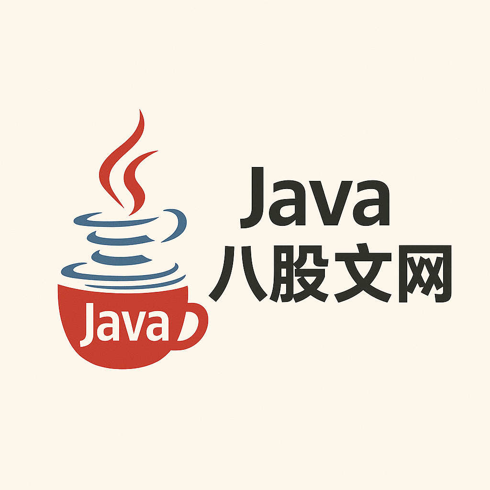

::: center

  <!-- 图片左侧容器 -->
  

    
  

  <!-- 文字右侧容器 -->
  

    

      Java面试八股文大全，涵盖Java基础、并发、JVM、Spring、MySQL、Redis、MyBatis、Spring、SpringBoot、SpringCloud、RocketMQ、Netty、Dubbo、Maven、设计模式、分布式、微服务、消息队列、缓存、数据结构、算法等高频考点，助力斩获大厂Offer！ 更多优质内容，持续更新中，敬请期待…… 
    

  

:::

🌟 **【重磅推荐】Java面试终极神器！「Java八股文网」全网首发，一站式攻克面试难题！** 🌟

无论你是应届生、跳槽党，还是技术进阶者，面对Java面试的“灵魂拷问”，是否总被这些问题困扰？  
❓ **技术点太杂，复习找不到重点？**  
❓ **项目经验单薄，不知如何包装？**  
❓ **分布式、高并发等硬核问题屡战屡败？**  
**👉 别慌！「Java八股文网」来了！史上最全Java面试题库+实战指南，助你斩获Offer！**

---

### **🔥 为什么选择「Java八股文网」？**
1. **全网最全题库**：覆盖Java全技术栈，从基础到分布式，从源码到调优，一网打尽！
2. **结构化分类**：清晰划分**面试流程**、**技术考点**、**项目实战**，精准定位薄弱环节！
3. **答案深度解析**：拒绝“死记硬背”，结合源码、场景、设计思想，直击面试官考察逻辑！
4. **持续更新迭代**：紧跟技术趋势（如Cola架构、Pulsar等），拒绝过时内容！
5. **完全免费开放**：无套路，无付费墙，技术人的纯粹分享社区！

---

### **🚀 网站核心内容一览**

#### **📌 一、面试流程全攻略**
- **简历突围**：STAR法则写项目经验，技术栈量化技巧，避开“已读不回”雷区！
- **自我介绍模板**：3分钟征服面试官的万能公式（附案例）！
- **高频非技术问题**：离职原因、职业规划、团队协作案例应答策略！
- **谈薪秘籍**：从薪资谈判到Offer选择，教你争取最优待遇！

#### **📌 二、Java技术八股文**
- **基础篇**：HashMap源码、JVM内存模型、并发编程（AQS/CAS）等必考硬核知识点！
- **框架篇**：Spring循环依赖、MyBatis缓存、SpringBoot自动配置原理源码级解析！
- **分布式篇**：
  - **中间件**：Redis分布式锁、Kafka高吞吐原理、RocketMQ事务消息！
  - **架构设计**：DDD领域驱动、Seata分布式事务、Sentinel熔断限流实战！
  - **性能优化**：MySQL索引优化、ES写入调优、ShardingJDBC分库分表策略！
- **算法与设计模式**：LeetCode高频题精讲、单例模式的双重校验锁陷阱剖析！

#### **📌 三、项目经历包装指南**
- **项目复盘方法论**：如何将“CRUD项目”讲出高并发架构设计？
- **难点突破案例库**：
  - 秒杀系统如何抗住10万QPS？
  - 分布式事务导致数据不一致的终极解决方案！
  - 从Full GC频发到JVM调优实战记录！
- **STAR法则实战**：用“背景-难点-行动-结果”量化项目价值，让面试官眼前一亮！

---

### **🎯 适合人群**
- **应届生**：快速构建Java知识体系，摆脱“项目空白”焦虑！
- **1-10年工程师**：突破技术瓶颈，冲刺P6/P7级高薪岗位！
- **转行者**：从零到Offer，系统性攻克Java面试难关！

---

### **📢 立即访问**
🔗 **网站地址**：Java八股文网  
📅 **每日更新**：关注官网公告，获取最新面试动态与技术解析！

---

**💬 用户评价**
> “刷完‘分布式事务’专题，终于搞懂了Seata的AT和TCC模式区别，面试直接拿下30%涨幅！” —— 某大厂后端工程师  
> “项目复盘模板太实用了！把之前的小项目包装成高并发案例，成功上岸阿里！” —— 应届生用户

---

**📌 温馨提示**：技术八股文是敲门砖，但真正的实力还需实践积累！建议结合网站内容+动手编码，双管齐下，成为Offer收割机！ 🚀

## 📌 友情提示

1. 建议使用Chrome浏览器获得最佳阅读体验
2. Ctrl+F快速搜索题目关键词
3. 收藏本站防止迷路：<https://java-baguwen.com>
4. 发现题目错误？[立即反馈](mailto:contact@java-baguwen.com)

**声明**：本网站所有题目均来自互联网公开渠道整理，仅供学习交流，严禁用于商业用途！