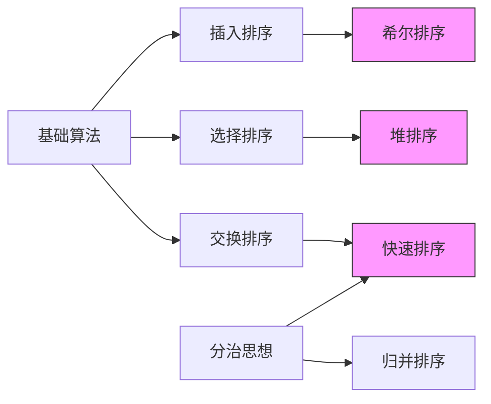

---

### 一、算法实现与可视化

#### 1. 冒泡排序（Bubble Sort）
**动态效果**：最大值像气泡逐渐上浮到末尾
```java
public static void bubbleSort(int[] arr) {
    for (int i = 0; i < arr.length - 1; i++) {
        boolean swapped = false;
        for (int j = 0; j < arr.length - 1 - i; j++) {
            if (arr[j] > arr[j + 1]) {
                swap(arr, j, j + 1);
                swapped = true;
            }
        }
        /* 可视化示例（第i轮结果）：
        原始数组：[5,3,8,6,2]
        第1轮后：[3,5,6,2,8] → ██████
        第2轮后：[3,5,2,6,8] → █████
        */
        if (!swapped) break;
    }
}
```

#### 2. 选择排序（Selection Sort）
**动态效果**：黄色区块标记当前最小值位置
```java
public static void selectionSort(int[] arr) {
    for (int i = 0; i < arr.length - 1; i++) {
        int minIndex = i;
        for (int j = i + 1; j < arr.length; j++) {
            if (arr[j] < arr[minIndex]) {
                minIndex = j; // 标记最小值位置
            }
        }
        swap(arr, i, minIndex);
        /* 可视化示例：
        数组状态：[5,3,8,6,2]
        第1轮：找到2交换到首位 → [2|3,8,6,5]
        第2轮：找到3保持不动 → [2,3|8,6,5]
        */
    }
}
```

#### 3. 插入排序（Insertion Sort）
**动态效果**：绿色区块表示已排序部分
```java
public static void insertionSort(int[] arr) {
    for (int i = 1; i < arr.length; i++) {
        int key = arr[i];
        int j = i - 1;
        while (j >= 0 && arr[j] > key) {
            arr[j + 1] = arr[j];
            j--;
        }
        arr[j + 1] = key;
        /* 可视化示例：
        当前处理元素：▇
        步骤演示：[2,5,7,▇4,9] → [2,5,▇4,7,9] → [2,▇4,5,7,9]
        */
    }
}
```

#### 4. 希尔排序（Shell Sort）
**动态效果**：按不同间隔分组排序
```java
public static void shellSort(int[] arr) {
    for (int gap = arr.length/2; gap > 0; gap /= 2) {
        for (int i = gap; i < arr.length; i++) {
            int temp = arr[i];
            int j;
            for (j = i; j >= gap && arr[j - gap] > temp; j -= gap) {
                arr[j] = arr[j - gap];
            }
            arr[j] = temp;
        }
        /* 可视化示例（gap=2）：
        分组排序：5 3 8 6 2 9 → 
        █组1：5,8,2 → 排序后2,5,8
        █组2：3,6,9 → 排序后3,6,9
        合并结果：2,3,5,6,8,9
        */
    }
}
```

#### 5. 归并排序（Merge Sort）
```java
public static void mergeSort(int[] arr) {
    if (arr.length < 2) return;
    int mid = arr.length / 2;
    int[] left = Arrays.copyOfRange(arr, 0, mid);
    int[] right = Arrays.copyOfRange(arr, mid, arr.length);
    mergeSort(left);
    mergeSort(right);
    merge(arr, left, right);
}

private static void merge(int[] arr, int[] left, int[] right) {
    int i = 0, j = 0, k = 0;
    while (i < left.length && j < right.length) {
        arr[k++] = left[i] < right[j] ? left[i++] : right[j++];
    }
    while (i < left.length) arr[k++] = left[i++];
    while (j < right.length) arr[k++] = right[j++];
    /* 合并过程可视化：
    左数组：[2,5,8] █████
    右数组：[3,6,9] █████
    合并结果：[2,3,5,6,8,9] ████████
    */
}
```

#### 6. 快速排序（Quick Sort）
```java
public static void quickSort(int[] arr, int low, int high) {
    if (low < high) {
        int pi = partition(arr, low, high);
        quickSort(arr, low, pi - 1);
        quickSort(arr, pi + 1, high);
    }
}

private static int partition(int[] arr, int low, int high) {
    int pivot = arr[high]; 
    int i = low;
    for (int j = low; j < high; j++) {
        if (arr[j] < pivot) {
            swap(arr, i++, j);
        }
    }
    swap(arr, i, high);
    return i;
    /* 分区可视化：
    基准值：9
    分区过程：5 3 8 6 2 9 → [5,3,8,6,2] 9 → 最终位置：5
    */
}
```

#### 7. 堆排序（Heap Sort）
```java
public static void heapSort(int[] arr) {
    // 建堆
    for (int i = arr.length/2 - 1; i >= 0; i--)
        heapify(arr, arr.length, i);
    // 提取元素
    for (int i = arr.length-1; i > 0; i--) {
        swap(arr, 0, i);
        heapify(arr, i, 0);
    }
}

private static void heapify(int[] arr, int n, int i) {
    int largest = i;
    int l = 2*i + 1;
    int r = 2*i + 2;
    
    if (l < n && arr[l] > arr[largest]) largest = l;
    if (r < n && arr[r] > arr[largest]) largest = r;
    
    if (largest != i) {
        swap(arr, i, largest);
        heapify(arr, n, largest);
    }
    /* 堆调整可视化：
    初始堆：9 6 8 3 5 2
    提取最大元素9后重新堆化：
    █6
    ├─█8
    │ ├─█5
    │ └─█2
    └─█3
    */
}
```

#### 8. 计数排序（Counting Sort）
```java
public static void countingSort(int[] arr) {
    int max = Arrays.stream(arr).max().getAsInt();
    int[] count = new int[max + 1];
    
    for (int num : arr) count[num]++;
    
    int index = 0;
    for (int i = 0; i <= max; i++) {
        while (count[i]-- > 0) {
            arr[index++] = i;
        }
    }
    /* 计数过程示例：
    原始数组：2,5,3,0,2,3,0,3
    计数数组：[2,0,2,3,0,1]
    最终结果：0,0,2,2,3,3,3,5
    */
}
```

#### 9. 桶排序（Bucket Sort）
```java
public static void bucketSort(int[] arr) {
    int bucketSize = 5;
    List<List<Integer>> buckets = new ArrayList<>();
    for (int i = 0; i < bucketSize; i++) {
        buckets.add(new ArrayList<>());
    }
    
    int max = Arrays.stream(arr).max().getAsInt();
    for (int num : arr) {
        int index = num * bucketSize / (max + 1);
        buckets.get(index).add(num);
    }
    
    int index = 0;
    for (List<Integer> bucket : buckets) {
        Collections.sort(bucket);
        for (int num : bucket) {
            arr[index++] = num;
        }
    }
    /* 分桶示例（bucketSize=5，max=9）：
    数值3 → 3*5/(9+1)=1.5 → 放入第1号桶
    分桶结果：[0-1], [2-3], [4-5], [6-7], [8-9]
    */
}
```

#### 10. 基数排序（Radix Sort）
```java
public static void radixSort(int[] arr) {
    int max = Arrays.stream(arr).max().getAsInt();
    for (int exp = 1; max/exp > 0; exp *= 10) {
        countingSortByDigit(arr, exp);
    }
}

private static void countingSortByDigit(int[] arr, int exp) {
    int[] output = new int[arr.length];
    int[] count = new int[10];
    
    for (int num : arr) {
        int digit = (num / exp) % 10;
        count[digit]++;
    }
    
    for (int i = 1; i < 10; i++) {
        count[i] += count[i - 1];
    }
    
    for (int i = arr.length - 1; i >= 0; i--) {
        int digit = (arr[i] / exp) % 10;
        output[--count[digit]] = arr[i];
    }
    
    System.arraycopy(output, 0, arr, 0, arr.length);
    /* 按位排序可视化：
    当前处理位：个位
    原始数组：[329,457,657,839,436,720,355]
    按个位分组：720 355 436 457 657 329 839
    */
}
```

---

### 二、算法分类
#### 1.1 存储方式分类
| 类型       | 特点                           | 典型算法           |
|------------|--------------------------------|--------------------|
| 内部排序   | 数据完全加载到内存             | 快速排序、堆排序   |
| 外部排序   | 海量数据需分批加载到内存处理   | 多路归并排序       |

#### 1.2 实现方式分类
| 类型         | 决策方式               | 代表算法           |
|--------------|-----------------------|--------------------|
| 比较类排序   | 通过元素比较确定顺序   | 快速排序、堆排序   |
| 非比较类排序 | 利用元素值特征计算位置 | 计数排序、基数排序 |

---

### 一、算法三维差异矩阵
从三个关键维度对比算法本质差异：

| 分类维度        | 代表算法                | 核心差异点                          |
|-----------------|-------------------------|-----------------------------------|
| **比较方式**    |                         |                                   |
| - 比较排序      | 快速/堆排序             | 依赖元素比较决策                  |
| - 非比较排序    | 计数/基数排序           | 利用数值特征定位                  |
| **稳定性**      |                         |                                   |
| - 稳定排序      | 归并/插入排序           | 相等元素相对位置不变              |
| - 非稳定排序    | 堆/希尔排序             | 可能改变相等元素顺序              |
| **空间复杂度**  |                         |                                   |
| - 原地排序      | 冒泡/堆排序             | O(1) 额外空间                    |
| - 非原地排序    | 归并/计数排序           | 需要线性额外空间                  |

---

### 二、算法演进关系图谱
揭示算法间的继承与改进关系：



关键演进路径：
1. **插入排序 → 希尔排序**：通过增量分组提升效率
2. **选择排序 → 堆排序**：利用堆结构优化极值查找
3. **交换排序 → 快速排序**：引入分区机制提高性能
4. **分治策略**：同时影响归并排序与快速排序

---

### 三、优缺点对比表
通过多指标评估算法特性：

| 算法         | 核心优势                          | 主要缺陷                          | 适用场景                  |
|--------------|-----------------------------------|-----------------------------------|-------------------------|
| **冒泡排序** | 实现简单、稳定排序                | 效率最低的O(n²)算法               | 教学演示/小数据集        |
| **快速排序** | 平均O(n log n)的最快实践          | 最坏O(n²)、递归栈溢出风险         | 通用数据排序             |
| **归并排序** | 稳定、最坏仍保持O(n log n)        | 需要O(n)额外空间                  | 大数据量/外部排序        |
| **堆排序**   | 原地排序、适合内存受限环境        | 访问模式不利于缓存利用            | 实时系统/嵌入式开发       |
| **计数排序** | 线性时间复杂度O(n+k)             | 仅适用于整数且范围较小            | 人口统计/成绩排序         |
| **基数排序** | 多维度排序能力                    | 依赖稳定子排序算法                | 电话号码/日期排序        |
| **桶排序**   | 高效处理均匀分布数据              | 性能受桶数量影响显著              | 均匀分布浮点数           |
| **希尔排序** | 突破O(n²)的插入改进版             | 增量序列选择影响性能              | 中等规模数据集           |
| **选择排序** | 交换次数最少(O(n))               | 比较次数仍为O(n²)                 | 减少写操作场景           |
| **插入排序** | 近乎有序数据效率趋近O(n)          | 逆序数据退化为O(n²)               | 小数据/部分有序数据       |

---

### 三、算法性能对比表
| 算法         | 时间复杂度          | 空间复杂度 | 稳定性 | 最佳场景               |
|--------------|---------------------|------------|--------|------------------------|
| **冒泡排序** | O(n²)               | O(1)       | 稳定   | 教学演示               |
| **快速排序** | O(n log n)          | O(log n)   | 不稳定 | 通用数据               |
| **桶排序**   | O(n + k)            | O(n + k)   | 稳定   | 均匀分布数据           |
| **基数排序** | O(nk)               | O(n + k)   | 稳定   | 固定位数整数           |
| **堆排序**   | O(n log n)          | O(1)       | 不稳定 | 内存受限环境           |

---

### 四、算法选择决策模型
根据实际场景需求进行多条件筛选：

1. **数据规模**
    - 小数据(n≤100)：优先选择插入排序
    - 大数据(n>1e5)：采用快速排序或归并排序

2. **数据特征**
    - 基本有序：插入排序最优
    - 大量重复元素：三向切分快排
    - 取值范围有限：计数/桶排序

3. **系统约束**
    - 内存紧张：堆排序/希尔排序
    - 稳定性要求：归并排序/插入排序

4. **数据类型**
    - 整数：可考虑基数排序
    - 对象：采用归并排序变种(TimSort)

---

### 五、典型算法内在联系

1. **分治思想双雄**
    - 快速排序：侧重**分区效率**，通过高效划分降低问题规模
    - 归并排序：强调**合并质量**，保证合并过程稳定有序

2. **选择排序家族**
    - 基础选择排序：线性查找极值
    - 堆排序：利用堆结构加速极值查找

3. **插入排序演进**
    - 传统插入排序：逐个元素定位
    - 希尔排序：通过增量分组实现跳跃式移动

4. **非比较排序共性**
    - 计数排序：基数排序的特例（单一位数排序）
    - 桶排序：广义版本的计数排序

---