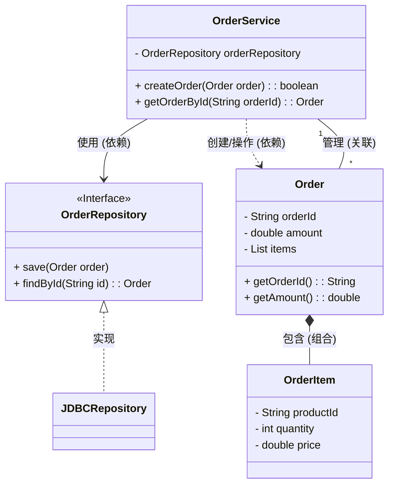

## Mermaid 使用教程：为Java工程师图解复杂系统与流程

作为中高级Java工程师，我们日常工作中除了编写高质量的代码，还需要花费大量时间在理解、设计、沟通复杂的系统架构、业务流程和代码逻辑上。传统的图形化绘图工具固然强大，但在团队协作、版本控制和文档维护方面常常显得力不从心：二进制文件难以Diff、修改需要打开特定软件、与Markdown文档集成不够顺畅。

这时，一款轻量级的**文本绘图工具**的价值便凸显出来。Mermaid正是这样一款工具，它允许你用简洁的文本语法绘制流程图、时序图、类图等多种图表，并能轻松集成到Markdown、Wiki、代码仓库等平台中。对于追求效率、注重协作和文档代码化的Java工程师来说，掌握Mermaid无疑是提升工作效率和沟通质量的利器。

本文将深入探讨Mermaid对Java工程师的价值，详细介绍其核心语法和几种最常用的图表类型，并通过贴近实际场景的示例，指导你如何利用Mermaid清晰、高效地表达技术概念。

### 第一章：Mermaid是什么？为什么Java工程师需要它？

**Mermaid**是一个基于JavaScript的图表绘制工具，它解析类似Markdown的文本语法，然后将其渲染成各种漂亮的图表。你可以简单地将Mermaid语法嵌入到支持它的平台（如GitHub、GitLab、JIRA、Confluence、许多静态博客生成器等），或者使用其在线编辑器。

**Mermaid的核心优势：**

1.  **文本化 (Text-based):** 图表即代码，用文本描述图表结构，易于编写和阅读。
2.  **版本控制友好 (Version Control Friendly):** 图表定义存储在文本文件中（如`.md`或`.mmd`），可以像代码一样进行版本管理（Git Diff、Commit、Branch Merge），彻底解决了二进制绘图文件难以Diff和合并的问题。
3.  **易于修改 (Easy to Edit):** 只需修改文本文件即可更新图表，比拖拽节点效率更高，尤其是在需要调整图表结构或布局时。
4.  **集成方便 (Easy Integration):** 与Markdown和众多支持的平台无缝集成，直接在文档中嵌入图表，保持文档与图表的一致性。

**Mermaid对Java工程师的实际价值：**

* **提高文档质量:** 在设计文档、README、Wiki页面中直接嵌入业务流程图、模块交互时序图，让文档更直观易懂。
* **简化设计交流:** 在代码评审 (Code Review)、技术分享时，快速绘制关键流程或时序图，清晰地向团队成员解释复杂逻辑或系统交互。
* **辅助代码理解:** 针对复杂的方法调用链或线程协作，绘制时序图，帮助自己或他人梳理逻辑。
* **梳理系统结构:** 绘制类图或组件图，帮助理解模块依赖、类关系或服务架构。
* **敏捷设计迭代:** 设计初期快速草绘各种图表，随着设计演进轻松修改，保持图表与设计的同步。
* **面试辅助:** 在白板或在线协作工具上，快速绘制图表辅助阐述设计思路或技术方案。

可以说，Mermaid是程序员社区在应对复杂性、追求效率和协作背景下催生的一种“工程师友好”的图表工具。

### 第二章：Mermaid基础语法与结构

Mermaid图表定义通常包含在一个特定的代码块中，以 `mermaid` 或 `mmd` 标识。基本结构如下：
```markdown
graph TD;
    A --> B;
    B --> C;
```


* **`graph TD;`**: 声明这是一个图表（`graph`），并指定方向为从上到下（`TD`，Top Down）。常见的方向还有 `LR` (Left Right)、`TB` (Top Bottom)、`RL` (Right Left)、`BT` (Bottom Top)。流程图通常使用 `graph` 关键字。
* **`sequenceDiagram`**: 声明这是一个时序图。
* **`classDiagram`**: 声明这是一个类图。
* **`stateDiagram-v2`**: 声明这是一个状态图（v2版本）。
* **`A`**: 定义一个节点。默认形状是矩形。
* **`-->`**: 定义一个连接线（箭头）。不同的箭头和连接线样式表示不同的关系（详见后续章节）。
* **`A --> B;`**: 表示从节点 A 到节点 B 有一条带箭头的连接线。语句以分号结束（虽然在简单场景下非必需，但建议保留以增加可读性）。

**节点形状和文本标签：**

你可以为节点定义更具描述性的文本标签和不同的形状。
```markdown
graph LR;
    A[这是节点A的文本] --> B(这是节点B);
    B -- 这是一条带文本的连接线 --> C{这是节点C};
    C -- 是 --> D([节点D]);
    C -- 否 --> E{节点E?};
```


* `方括号[]`: 默认矩形节点，文本在方括号内。
* `圆角矩形()`: 文本在圆括号内。
* `大括号{}`: 菱形节点，常用于表示决策。
* `([ ])`: 圆柱形节点，常用于表示数据库。

### 第三章：面向Java工程师的常用图表类型深度实践

本章将详细介绍Java工程师在日常工作中特别有用的几种Mermaid图表类型，并提供实用的代码示例和讲解。

#### 3.1 流程图 (Flowcharts)

流程图是表达业务流程、代码逻辑、程序执行路径最直观的方式。Mermaid的流程图强大且灵活。

**核心元素:** 节点、连接线、方向控制、子图。

**示例：用户注册流程**
```markdown
graph TD
    A[用户访问注册页] --> B{填写注册信息?};
    B -- 否 --> A;
    B -- 是 --> C[提交注册请求];
    C --> D(校验用户信息);
    D -- 校验通过 --> E[创建用户记录];
    D -- 校验失败 --> F[返回错误提示];
    E --> G[发送激活邮件];
    G --> H[注册成功];
    F --> A;

    subgraph 子流程：激活邮件
        G --> I[用户点击激活链接];
        I --> J(验证激活码);
        J -- 验证通过 --> K[激活用户账号];
        J -- 验证失败 --> L[激活失败提示];
    end
```

```mermaid
graph TD
    A[用户访问注册页] --> B{填写注册信息?};
    B -- 否 --> A;
    B -- 是 --> C[提交注册请求];
    C --> D(校验用户信息);
    D -- 校验通过 --> E[创建用户记录];
    D -- 校验失败 --> F[返回错误提示];
    E --> G[发送激活邮件];
    G --> H[注册成功];
    F --> A;

    subgraph 子流程：激活邮件
        G --> I[用户点击激活链接];
        I --> J(验证激活码);
        J -- 验证通过 --> K[激活用户账号];
        J -- 验证失败 --> L[激活失败提示];
    end
```

**深度使用提示:**

* **子图 (Subgraph):** 使用 `subgraph 子图名称 ... end` 将相关的节点组合在一起，可以有效降低大型流程图的复杂度，体现模块或子流程的概念。
* **连接线文本:** 在连接线上添加文本（如 `-- 是 -->`），清晰表示流程的分支条件或描述流程的传递内容。
* **节点形状选择:** 合理使用不同形状的节点（菱形表示决策、圆角矩形表示操作、平行四边形表示输入/输出等），增强图表的语义性。

#### 3.2 时序图 (Sequence Diagrams)

时序图非常适合表示系统中对象或服务之间的交互顺序，对于理解分布式系统中的服务调用、异步通信、多线程协作等场景极其有用。

**核心元素:** 参与者、消息、生命线、激活框、Alt/Loop/Par结构。

**示例：简单的服务调用时序**

模拟用户调用订单服务下单，订单服务调用库存服务检查库存，然后返回结果。
```markdown
sequenceDiagram
    participant User
    participant OrderService
    participant InventoryService

    User->>OrderService: 发起下单请求(createOrder)
    activate OrderService
    OrderService->>InventoryService: 检查库存(checkStock)
    activate InventoryService
    InventoryService-->>OrderService: 返回库存结果
    deactivate InventoryService
    OrderService-->>User: 返回下单结果
    deactivate OrderService
```


**深度使用提示:**

* **消息类型:** `->>` 表示同步调用（有返回），`->` 表示异步调用（无返回），`-->>` 和 `-->` 表示返回消息。正确使用这些箭头能准确反映通信模式。
* **激活框 (Activation):** 使用 `activate` 和 `deactivate` 表示参与者在一段时间内处于活动状态，这有助于理解控制流和方法调用栈。
* **分组结构 (Alt/Loop/Par):** 使用 `alt/else` 表示选择分支，`loop` 表示循环，`par` 表示并行处理。这些结构对于表达复杂的控制逻辑至关重要。
```markdown
sequenceDiagram
    participant Client
    participant AuthServer
    participant ResourceServer

    Client->>AuthServer: 发送认证请求
    activate AuthServer
    AuthServer-->>Client: 返回Access Token
    deactivate AuthServer

    Client->>ResourceServer: 发送请求(携带Access Token)
    activate ResourceServer
    alt Valid Token
        ResourceServer->>Client: 返回资源数据
    else Invalid Token
        ResourceServer-->>Client: 返回错误码(401)
    end
    deactivate ResourceServer

    Client->>ResourceServer: 再次请求 (携带 Access Token)
    loop Retry up to 3 times
        Client->>ResourceServer: 发送请求
        activate ResourceServer
        ResourceServer-->>Client: 返回数据或错误
        deactivate ResourceServer
    end
```


#### 3.3 类图 (Class Diagrams)

类图用于展示类、接口等的设计结构、成员属性、方法以及它们之间的关系。对于梳理模块内部结构、理解开源库设计、或者在设计阶段讨论类模型非常有帮助。

**核心元素:** 类、属性、方法、可见性、类间关系。

**示例：简单的订单相关类结构**
```markdown
classDiagram
    class OrderService {
        - OrderRepository orderRepository
        + createOrder(Order order) : boolean
        + getOrderById(String orderId) : Order
    }

    class OrderRepository {
        <<Interface>>
        + save(Order order)
        + findById(String id) : Order
    }

    class Order {
        - String orderId
        - double amount
        - List<OrderItem> items
        + getOrderId() : String
        + getAmount() : double
    }

    class OrderItem {
        - String productId
        - int quantity
        - double price
    }

    OrderService --> OrderRepository : 使用 (依赖)
    OrderService ..> Order : 创建/操作 (依赖)
    OrderRepository <|.. JDBCRepository : 实现
    Order *-- OrderItem : 包含 (组合)
    OrderService "1" -- "*" Order : 管理 (关联)

    class JDBCRepository
```



**深度使用提示:**

* **可见性修饰符:** 使用 `+` (public), `-` (private), `#` (protected), `~` (package) 准确表示成员的可见性，反映设计的封装性。
* **类间关系:** 准确使用不同的箭头表示类之间的关系，这是类图的核心。
    * `--|>`: 继承 (Inheritance)
    * `--..|>`: 实现 (Implementation)
    * `-->`: 关联 (Association) - 最常见的关系，表示一个类引用另一个类。
    * `--o`: 聚合 (Aggregation) - 表示整体与部分的关系，部分可以独立存在。
    * `--*`: 组合 (Composition) - 表示整体与部分的关系，部分不能独立存在（整体生命周期包含部分）。
    * `..>`: 依赖 (Dependency) - 表示一个类临时使用另一个类（如方法参数、局部变量）。
* **接口和抽象类:** 使用 `<<Interface>>` 或 `<<Abstract>>` 标记接口或抽象类。

#### 3.4 状态图 (State Diagrams)

状态图用于描述一个对象或一个系统在其生命周期内可能的状态以及在不同事件触发下的状态变迁。对于设计和理解复杂的状态机（如订单状态、工作流节点状态等）非常有用。

**核心元素:** 状态、转换、初始状态、事件触发。

**示例：简单的订单状态机**
```markdown
stateDiagram-v2
    [*] --> 已创建
    已创建 --> 已支付 : 用户完成支付
    已创建 --> 已取消 : 用户取消订单
    已支付 --> 待发货 : 支付成功处理
    待发货 --> 已发货 : 仓库发货
    已发货 --> 已完成 : 用户确认收货
    已发货 --> 已退回 : 用户申请退货
    已完成 --> 已归档 : 达到归档条件
    已退回 --> 已取消 : 退货处理完成
    已支付 --> 已退款 : 用户申请退款
    已退款 --> 已取消 : 退款处理完成
```


**深度使用提示:**

* `[*]`: 表示图表的初始状态。
* **转换标签:** 在转换箭头上添加文本（如 `: 用户完成支付`），清晰说明状态变迁是由什么事件触发的。
* **嵌套状态:** 复杂状态图可以使用嵌套来组织相关状态，但Mermaid的嵌套语法相对简洁，主要用于视觉分组。对于非常复杂的状态图，可能需要结合其他工具或更高级的状态机建模语言。

### 第四章：提升图表表现力的进阶功能

除了基本图表语法，Mermaid还提供一些功能让你的图表更清晰、更易读。

* **节点样式:** 为特定节点定义样式，例如改变颜色或形状，突出关键节点。
```markdown
graph LR
    A[重要步骤] --> B(下一步);
    style A fill:#f9f,stroke:#333,stroke-width:2px;
```


* **连接线样式:** 改变连接线的粗细或颜色。
```markdown
graph LR
    A --> B;
    C -.- D; %% 虚线
    E === F; %% 粗线
    linkStyle 0 stroke:#f00,stroke-width:2px; %% 给第一条连接线（索引0）加样式
```

```mermaid
graph LR
    A --> B;
    C -.- D; %% 虚线
    E === F; %% 粗线
    linkStyle 0 stroke:#f00,stroke-width:2px; %% 给第一条连接线（索引0）加样式
```

* **添加注释:** 使用 `%%` 添加单行注释，不会被渲染到图表中。
```markdown
graph TD
    A --> B; %% 这是注释
```

```mermaid
graph TD
    A --> B; %% 这是注释
```

* **设置点击链接:** 让图表中的节点可以点击跳转到其他URL或执行JavaScript（在支持的环境中）。
```markdown
graph LR
    A[GitHub] --> B[Mermaid];
    click A "https://github.com/" "前往GitHub"; %% 点击A跳转GitHub
    click B "https://mermaid.js.org/" _blank; %% 点击B跳转Mermaid官网，在新窗口打开
```

```mermaid
graph LR
    A[GitHub] --> B[Mermaid];
    click A "https://github.com/" "前往GitHub"; %% 点击A跳转GitHub
    click B "https://mermaid.js.org/" _blank; %% 点击B跳转Mermaid官网，在新窗口打开
```

### 第五章：Mermaid的集成与工作流

Mermaid最大的优势在于其易于集成的工作流。

* **在Markdown中使用:** 大多数现代Markdown渲染器（如GitHub、GitLab、Gitee、JIRA、Confluence Cloud、VS Code预览、许多静态网站生成器如Jekyll、Hugo等）都原生支持Mermaid。只需将Mermaid语法放在以 ````mermaid` 或 ````mmd` 开始和结束的代码块中即可。
* **在线编辑器:** Mermaid官方提供了 [Mermaid Live Editor](https://mermaid.live/)，你可以在其中编写、预览和导出Mermaid图表（PNG, SVG）。这是学习和尝试语法的好地方。
* **浏览器插件/桌面应用:** 有一些浏览器插件或桌面应用支持Mermaid预览和编辑，提供更流畅的体验。
* **与技术文档生成集成:** 虽然没有直接将Mermaid图表嵌入JavaDoc的标准化方式，但许多现代技术文档平台（如基于MkDocs, Sphinx等）都支持Mermaid插件，你可以在文档源文件中嵌入Mermaid语法，生成HTML时自动渲染图表。
* **版本控制中的协作:** 由于是文本文件，团队成员可以在Pull Request中对图表定义进行Code Review，修改冲突也非常直观。

### 结语

Mermaid作为一种轻量级、文本化的图表绘制工具，为Java工程师提供了一种高效且版本控制友好的方式来可视化复杂的系统和流程。掌握Mermaid不仅能提升你文档的质量和沟通的效率，更能作为你梳理设计思路、理解现有系统结构的有力工具。
